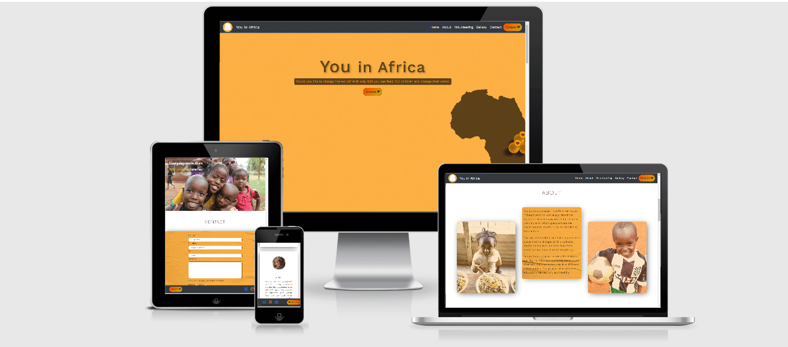

# [You in Africa](https://henriqueperoni.github.io/CI-MS1-You-in-Africa/)

The aim of this project is to show what You in Africa is, how it works. Thus getting donations and volunteers to help You in Africa. I explained how the project started, and what has been done so far.

## Table of Contents:
* [User Experience](#user-experience)
    * [Strategy](#1-strategy)
    * [Scope](#2-scope)
    * [Structure](#3-structure)
    * [Skeleton](#4-skeleton)
    * [Surface](#5-surface)

* [Features](#features)
    * [Existing Features](#existing-features)
    * [Features Left to Implement When Skills Develop](#features-left-to-implement-when-skills-develop)

* [Technologies Used](#technologies-used)
    * [Languages](#1-languages)
    * [Integrations](#2-integrations)
    * [Workspace, Version Control, and Repository Storage](#3-workspace-version-control-and-repository-storage)
    
* [Resources](#resources)

* [Testing](#testing)

* [Deployment](#deployment)

* [Credits](#credits)
    * [Content](#content)
    * [Media](#media)
    * [Code](#code)

* [Acknowledgements](#acknowledgements)

## User Experience

### 1. Strategy
Project Goals:

* To learn about what the project is.

* To be able to easily donate and increase donations.

* Create a website that is visually appealing, and fully responsive on all devices and screen sizes.

Customer Goals:
* Website clear and user friendly. Explain as much as possible about the project, but keep it short and simple to not overwhelm.

* Easy way to donate.

* Inspire people to become a volunteer.

### 2. Scope
I kept the project simple enough to be understood with no difficult and the user have a good experience

* Learn more about the project

* Easy way to donate

* Easy way to apply to become a volunteers

* Contact with a question

* Visit social media channels

* I used some animations to make de user experience more pleasent and enchanting

### 3. Structure

The main goal here is to allow users to quickly assimilate the information. The fixed navigation bar for the desktop screen and fixed footer for the smaller screens was one of the most important things because with it the user always will be close to a donation button. 

Although the main goal of the website is to get more donations, I did not want to look like the project is just about money. With this in mind, I made it clear that be a volunteer or share the project on social media was a big help as well.

### 4. Skeleton

* [Wireframes](assets/docs/wireframe.pdf)

* Home, About, Volunteering, Galerry, and Contact Section.

* Fixed navigation bar on large screens with the menu headings and donate button.

* Fixed Footer on small screens with social media icons and donate button.

### 5. Surface

**Colours**: As the project already had pages on social media with defined colors, I decided to keep basically keep the same style.
I used to main colors a dark yellow #F18E04 and a standard brown #5C411A, which provides a good contrast.

**Typography**: In the beginning, I wanted to use a different font for headings and general text, but choosing Work Sans was great because it looks nice for both cases.
I only used Signika for the pictures on the carousel because it looked better.

**Images**: All the images were provided by You in Africa.

## Features

### Existing Features
* Designed with HTML5, CSS3 and Bootstrap.

* Donate button directing to another website.

* Fixed navigation bar for large screens to keep visible the donate button.

* Fixed footer for small screens to keep visible the donate button.

* Contact Form with radio buttons.

### Features Left to Implement when skills develop
* Donate button directing to a page on the website with a payment system.

## Technologies Used

### 1. Languages
* [HTML5](https://en.wikipedia.org/wiki/HTML5) - Used to create the form and add content to the website.

* [CSS](https://en.wikipedia.org/wiki/CSS) - Used to style the HTML5 elements.

### 2. Integrations
* [Bootstrap](https://getbootstrap.com/) - I used Bootstrap's for the navigation bar and carousel.

* [Google Fonts](https://fonts.google.com/) - Typography.

* [FontAwesome](https://fontawesome.com/) - Used for icons.

### 3. Workspace, version control, and repository storage

* [Gitpod](https://www.gitpod.io/) - IDE (Integrated Development Environment) used to write the code.

* [GitHub](https://github.com/) - writ someting

* [Git](https://git-scm.com/) - Version control tool to record changes and updates to my files.

## Resources

[Deep Image](https://deep-image.ai/) - Enhance image.

[CSS Matic](https://www.cssmatic.com) - Box Shadow Genetator.

[Stack Overflow](https://pt.stackoverflow.com/) - General resource.

[CSS Gradient](https://cssgradient.io/) - Gradient Generator

[W3.CSS](https://www.w3schools.com/w3css/defaulT.asp) - General resource.

[Youtube](https://www.youtube.com/) - General resource.

[CommonMark](https://commonmark.org/) - For Markdown language reference.

[Coolors](https://coolors.co/) - Find matching color palette for site.

[TinyPNG](https://tinypng.com/) - Efficient compression of images for site.

[Balsamiq](https://balsamiq.com/wireframes/) - Wireframing design tool.

Code Institute SLACK Community - General Resource

## Testing

* [W3C Markup Validation](https://validator.w3.org/) - Used for validity HTML

* [W3 CSS Validation Service](https://jigsaw.w3.org/css-validator/) - Used for validity CSS

* Tested across multiple browsers (Chrome, Safari, Firefox, Internet Explorer)

* Tested on multiple mobile devices (iPhone 7, 8, X, Samsung Galaxy, and Xiaomi)

* Tested About, Gallery, Volunteering, and Contact links in the menu to make sure it points to each page correctly.

* Tested the Donate Button and Social Media icons to make sure they open the correct pages in a new tab on the browser.

* Tested carousel arrows move to the next image correctly and increase the size of the arrows to make it more visible.

* Tested Name and Email to check the input were required.

* Tested Name, Phone Number, and Email request the right input. Not allowing you to put numbers on the name or leave the email without a "@"

* Tested radio buttons to make sure only one option can be selected

## Deployment

This project has been deployed on GitHub Pages with the following process:

1. All code was written on Gitpod, an online IDE.

2. The code was then pushed to GitHub where it is stored in my Repository.

3. Under the settings section of the GitHub repository, scroll down to the GitHub Pages section.

4. Under 'Source' drop-down, the 'Master branch' was selected.

5. Once selected, this publishes the project to GitHub Pages and displays the site URL.

6. There is no difference between the deployed version and the development version.

7. The code can be run locally through clone or download.

8. You can do this by opening the repository, clicking on the green 'Code' button, and selecting either 'clone or download'.

9. The Clone option provides a URL, which you can use on your desktop IDE.

10. The Download ZIP option provides a link to download a ZIP file that can be unzipped on your local machine.

## Credits

### Content

Most of the content was provided from the [Instagram page](https://www.instagram.com/youinafricaoficial/) of You in Africa. I just had to translate and made a few modifications to make more sense for English speakers. I also had the fundamental help from the volunteers of the project who helped with beautiful testimonies.

### Media

All the images were provided from You in Africa team. I only had to edit some images.

### Code

I used a lot of flex-boxes on my project, I searched a lot on Google about it, but this particular [video](https://www.youtube.com/watch?v=JJSoEo8JSnc) helped a lot to understand it deeper.

## Acknowledgements

* Thanks to my mentor Excellence Ilesanmi for his time, patience, and excellent advice.

* Thanks to the Code Institute Slack Community. Without you, it would have been much harder.

* Thanks to my wife for all the support she gave me.

